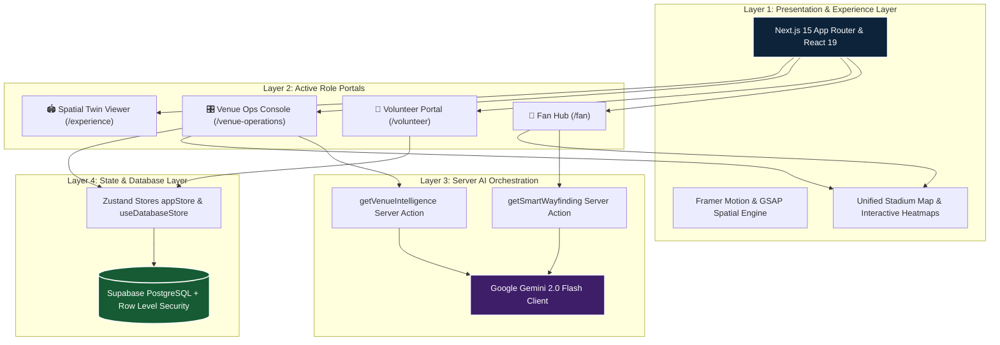

<div align="center">

# ⚽ A E T H E R I S
### AI-Powered Spatial Intelligence Platform for FIFA World Cup 2026

[](https://nextjs.org/)
[](https://react.dev/)
[](https://www.typescriptlang.org/)
[](https://deepmind.google/technologies/gemini/)
[](https://supabase.com/)
[](https://tailwindcss.com/)
[](https://playwright.dev/)

<p align="center">
  <strong>"The stadium is the operational canvas. Intelligence is the primary product."</strong>
</p>

[Explore Documentation](docs/00_INDEX.md) • [System Architecture](docs/03_SYSTEM_ARCHITECTURE.md) • [Product Vision](docs/01_PRODUCT_VISION.md) • [Persona Experience](docs/07_PERSONA_EXPERIENCE.md)

---

</div>

## 🌌 Overview

**Aetheris** transforms static physical stadiums into dynamic, proactive operational intelligence canvases for the **FIFA World Cup 2026** at Estadio Azteca. Grounded in official FIFA venue operational standards, Aetheris replaces traditional reactive dashboards with server-side **Google Gemini 2.0 AI Orchestration**, live spatial heatmaps, incident management dispatch loops, and real-time multilingual translation engines tailored specifically for Fans, Volunteers, and Venue Operations teams.

```
                  ┌──────────────────────────────────────────────┐
                  │            A E T H E R I S                   │
                  │   FIFA 2026 SPATIAL INTELLIGENCE CORE        │
                  └──────────────────────┬───────────────────────┘
                                         │
       ┌─────────────────┬───────────────┴───────────────┬─────────────────┐
       ▼                 ▼                               ▼                 ▼
┌──────────────┐  ┌──────────────┐               ┌──────────────┐  ┌──────────────┐
│  🎫 FAN      │  │ 🤝 VOLUNTEER │               │ 🎛️ VENUE OPS  │  │ 🏟️ SPATIAL    │
│  HUB (/fan)  │  │ (/volunteer) │               │ CONTROL ROOM │  │  EXPERIENCE  │
└──────┬───────┘  └──────┬───────┘               └──────┬───────┘  └──────┬───────┘
       │                 │                               │                 │
       └─────────────────┴───────────────┬───────────────┴─────────────────┘
                                         ▼
                 ┌───────────────────────────────────────────────┐
                 │       NEURAL INTELLIGENCE ORCHESTRATION       │
                 │    (Gemini 2.0 Flash + Live Spatial State)    │
                 └───────────────────────────────────────────────┘
```

---

## ⚡ Quick Navigation

- [✨ Core Philosophy](#-core-philosophy--invisible-ai)
- [🏗️ Codebase System Architecture](#%EF%B8%8F-codebase-system-architecture)
- [👥 Active Personas & Role Portals](#-active-personas--role-portals)
- [🧠 Built-In AI Intelligence Engines](#-built-in-ai-intelligence-engines)
- [🛠️ Tech Stack & Neural Arsenal](#%EF%B8%8F-tech-stack--neural-arsenal)
- [🚀 Quick Start & Installation](#-quick-start--installation)
- [📜 NPM Scripts Matrix](#-npm-scripts-matrix)
- [🗄️ Database Schema & Security](#%EF%B8%8F-database-schema--security)
- [📚 Complete Documentation Index](#-complete-documentation-index)

---

## ✨ Core Philosophy: Invisible AI

Traditional stadium dashboards force staff to dig through dense data tables or wait for manual complaints before reacting. Aetheris embeds **Invisible AI** into every layer of the venue experience:

| Traditional Venue Systems | Aetheris Spatial Intelligence Engine |
| :--- | :--- |
| **Reactive**: Reports gate bottlenecks after crowds pile up | **Proactive**: Predicts 15-minute crowd density risks via Gemini 2.0 |
| **Monolithic**: Single dense interface crammed with raw data | **Role-Scoped**: Customized portals for Fans, Volunteers, and Ops |
| **Static Directions**: Fixed signage and top-down map images | **Smart Wayfinding**: Dynamic seat & gate routing avoiding congested zones |
| **Language Barriers**: Manual phrasebooks for staff | **AI Translator**: Zero-latency real-time multilingual assistant |

> [!IMPORTANT]
> **Aetheris Golden Rule:** If there is ever a conflict between technical elegance and user experience, **the user experience wins**.

---

## 🏗️ Codebase System Architecture

The application is structured into a clean **4-Layer Architecture** decoupling spatial venue state from presentation components:



---

## 👥 Active Personas & Role Portals

Aetheris delivers tailored, role-based experiences built directly into `src/app/`:

### 🎫 1. Fan Matchday Hub (`/fan`)
- **Digital Ticket Wallet** (`DigitalTicket.tsx`): Displays match details, entry gate (e.g. Gate C), section, row, and seat allocation with scannable ticket status.
- **Smart Wayfinding Banner** (`SmartWayfindingBanner.tsx`): AI-driven personalized route instructions dynamically avoiding high-density concourses.
- **Stadium Map & Amenities** (`UnifiedStadiumMap.tsx`): Interactive gate throughput, seat section locators, and concessions finder.
- **Matchday Guide**: Comprehensive stadium policies, accessibility guidelines, and entry procedures.

### 🤝 2. Volunteer Command Center (`/volunteer`)
- **Real-Time Task Dispatch Board**: Interactive queue for accepting and completing ground tasks (`acceptTask`, `completeTask`).
- **Live AI Multilingual Translator** (`/volunteer/translate`): Real-time language translation enabling local volunteers to assist international World Cup fans seamlessly.
- **Zone SOP Guides**: Instant access to venue operational procedures and fan guidance protocols.

### 🎛️ 3. Venue Operations Control Room (`/venue-operations`)
- **Gate Throughput & Density Heatmaps**: Live monitoring of gate capacities (e.g. North Gate, South Gate, East Concourse).
- **Incident Management & Dispatch** (`/venue-operations/incidents`, `/venue-operations/dispatch`): Real-time incident reporting, priority triage, and volunteer dispatching via `IncidentDrawer.tsx`.
- **Gemini 2.0 Risk Intelligence Feed**: Real-time AI analysis forecasting venue risks and throughput bottlenecks.

### 🏟️ 4. Spatial Twin Visualizer (`/experience`)
- **3D Stadium Environment Engine** (`ExperienceSelector.tsx`): Interactive digital twin stadium view supporting preset environment states (`day`, `night`, `event`, `emergency`).

---

## 🧠 Built-In AI Intelligence Engines

Aetheris powers stadium operations through five native intelligence engines:

| Engine | File Location | Operational Capability |
| :--- | :--- | :--- |
| 🔮 **Venue Intelligence Engine** | `src/app/actions/intelligence.ts` | Uses Gemini 2.0 Flash to evaluate throughput/capacity ratios across Estadio Azteca zones and predict emerging crowd risks 15 minutes ahead. |
| 🧭 **Smart Wayfinding Engine** | `src/app/actions/intelligence.ts` | Generates personalized, turn-by-turn fan navigation avoiding congested stadium concourses and busy turnstiles. |
| 🌐 **Live Multilingual Translator** | `src/app/volunteer/(portal)/translate` | Translates fan queries across global languages into clear volunteer instructions. |
| 🚨 **Incident Dispatch & Management Bus** | `src/store/useDatabaseStore.ts` | Manages live incident reporting (`reportIncident`), priority triage (`high`/`medium`/`low`), and responder task assignments. |
| 🗺️ **Unified Stadium Spatial Map** | `src/components/shared/UnifiedStadiumMap.tsx` | Visualizes live zone density states (`low`, `medium`, `high`, `critical`) and gate throughput telemetry. |

---

## 🛠️ Tech Stack & Neural Arsenal

### Core Framework & UI
- **Framework**: [Next.js 15](https://nextjs.org/) (App Router, Server Actions, Server Components)
- **Library**: [React 19](https://react.dev/)
- **Language**: [TypeScript 6](https://www.typescriptlang.org/)
- **Styling**: [Tailwind CSS v4](https://tailwindcss.com/)
- **Animations**: [Framer Motion](https://www.framer.com/motion/) & [GSAP](https://gsap.com/)
- **Icons**: [Lucide React](https://lucide.dev/)

### AI & State Architecture
- **AI Engine**: Google Gemini 2.0 SDK (`@google/generative-ai`)
- **Global State**: [Zustand v5](https://github.com/pmndrs/zustand) (`app-store`, `useDatabaseStore`, `useFanExperienceStore`)
- **Data Fetching**: [TanStack React Query v5](https://tanstack.com/query/latest)
- **Database & Auth**: [Supabase SSR](https://supabase.com/) (`@supabase/ssr`, `@supabase/supabase-js`)
- **Form Validation**: [Zod](https://zod.dev/) & [React Hook Form](https://react-hook-form.com/)

### Quality & Testing
- **E2E Testing Suite**: [Playwright](https://playwright.dev/)
- **Code Quality**: ESLint 9 & Prettier 3

---

## 🚀 Quick Start & Installation

### Prerequisites
- **Node.js**: `v20.0.0` or higher
- **npm**: `v10.0.0` or higher
- **Google Gemini API Key**: For AI Orchestration features

### 1. Clone & Install Dependencies

```bash
# Clone repository
git clone https://github.com/Kirito0088/Aetheris.git

# Navigate into project
cd Aetheris

# Install dependencies
npm install
```

### 2. Configure Environment Variables

Create `.env.local` in the project root:

```env
# Supabase Configuration
NEXT_PUBLIC_SUPABASE_URL=https://your-supabase-project.supabase.co
NEXT_PUBLIC_SUPABASE_ANON_KEY=your-supabase-anon-key
SUPABASE_SERVICE_ROLE_KEY=your-supabase-service-role-key

# Google Gemini AI Key
GEMINI_API_KEY=your-google-gemini-api-key

# App Environment
NEXT_PUBLIC_APP_URL=http://localhost:3000
```

### 3. Seed Personas & Run Tests

```bash
# Seed mock personas
npm run seed:personas

# Run E2E tests
npm run test:e2e
```

### 4. Launch Development Server

```bash
npm run dev
```

Visit [http://localhost:3000](http://localhost:3000) to launch Aetheris.

---

## 📜 NPM Scripts Matrix

| Command | Action |
| :--- | :--- |
| `npm run dev` | Starts Next.js development server |
| `npm run build` | Builds production-optimized bundle |
| `npm run start` | Serves production build |
| `npm run type-check` | Runs TypeScript compiler checks (`tsc --noEmit`) |
| `npm run lint` | Analyzes codebase with ESLint |
| `npm run lint:fix` | Fixes linting violations automatically |
| `npm run format` | Formats code with Prettier |
| `npm run seed:personas` | Seeds test persona records |
| `npm run test:e2e` | Runs Playwright end-to-end integration tests |

---

## 🗄️ Database Schema & Security

Aetheris utilizes Supabase PostgreSQL with **Row Level Security (RLS)**:

- **`0001_initial_schema.sql`**: Core tables for stadium zones, gates, crowd snapshots, and user profiles.
- **`0002_incident_validation.sql`**: Triggers for validating incident severity and location zones.
- **`0003_volunteer_status.sql`**: Spatial status heartbeats and volunteer task assignment tracking.

---

## 📚 Complete Documentation Index

All operational and design specifications are maintained in the [`docs/`](docs/00_INDEX.md) folder:

| Document | Focus Area |
| :--- | :--- |
| 📖 [**00_INDEX.md**](docs/00_INDEX.md) | Master sitemap & documentation hierarchy |
| 👁️ [**01_PRODUCT_VISION.md**](docs/01_PRODUCT_VISION.md) | Platform constitution & Invisible AI philosophy |
| 🎯 [**02_PROMPTWARS_STRATEGY.md**](docs/02_PROMPTWARS_STRATEGY.md) | Strategic alignment & competition scoring |
| 🏛️ [**03_SYSTEM_ARCHITECTURE.md**](docs/03_SYSTEM_ARCHITECTURE.md) | Deep technical architecture & component interactions |
| 🎨 [**04_DESIGN_SYSTEM.md**](docs/04_DESIGN_SYSTEM.md) | Typography, colors & FIFA broadcast graphics tokens |
| 🤖 [**05_AI_TOOLCHAIN.md**](docs/05_AI_TOOLCHAIN.md) | Gemini model prompts, MCP tools & AI skills |
| 🗺️ [**06_IMPLEMENTATION_ROADMAP.md**](docs/06_IMPLEMENTATION_ROADMAP.md) | Phased engineering execution milestones |
| 👤 [**07_PERSONA_EXPERIENCE.md**](docs/07_PERSONA_EXPERIENCE.md) | Deep breakdown of persona journeys |
| 🎬 [**08_DEMO_STORY.md**](docs/08_DEMO_STORY.md) | Narrative demo scenario & script |

---

<div align="center">

### ⚽ Aetheris — Designed for the FIFA World Cup 2026
*Built with precision, powered by intelligence.*

</div>
