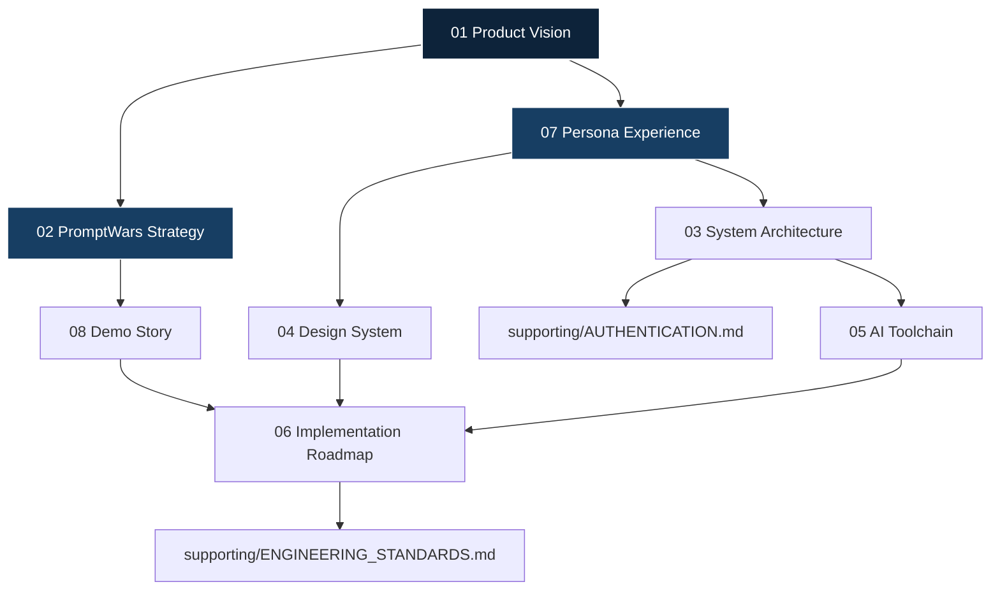

# 00 Aetheris Documentation Index

> **Purpose**: The definitive homepage and table of contents for all Aetheris engineering and product documentation.
> **Audience**: All Contributors (Engineering, Design, Product)
> **Owner**: Core Team
> **Status**: Active
> **Version**: 3.0
> **Last Updated**: July 2026

## Welcome to Aetheris
Aetheris is an AI-powered Stadium Intelligence Platform designed specifically for the FIFA World Cup 2026. This documentation is the single source of truth for the platform's vision, architecture, and execution.

It is written and maintained as if it belongs to a world-class product organization. If there is ever a conflict between technical elegance and user experience, the user experience wins.

---

## Current Project Status
- **Current Version**: 3.0
- **Current Phase**: Phase 6 — Experience Design

---

## Reading Order & Quick Navigation
New contributors must read the documentation in the following strict order to understand the product context before viewing any code.

1. **[01_PRODUCT_VISION.md](01_PRODUCT_VISION.md)**
   The constitution of Aetheris. Defines what we are building, who we are building it for, and the "Invisible AI" philosophy.
2. **[02_PROMPTWARS_STRATEGY.md](02_PROMPTWARS_STRATEGY.md)**
   Our competitive strategy for the challenge, aligning our product with the judges' psychological and assessment parameters.
3. **[03_SYSTEM_ARCHITECTURE.md](03_SYSTEM_ARCHITECTURE.md)**
   The technical blueprint of the intelligence engines, highlighting how we orchestrate data rather than how we render 3D pixels.
4. **[04_DESIGN_SYSTEM.md](04_DESIGN_SYSTEM.md)**
   The design bible. Covers typography, color, motion, and interaction rules to ensure Aetheris feels like a premium, official product.
5. **[05_AI_TOOLCHAIN.md](05_AI_TOOLCHAIN.md)**
   Documentation of the LLM models, MCPs, and specialized skills utilized across development and the live platform.
6. **[06_IMPLEMENTATION_ROADMAP.md](06_IMPLEMENTATION_ROADMAP.md)**
   The experience-first execution plan governing what we build and when.
7. **[07_PERSONA_EXPERIENCE.md](07_PERSONA_EXPERIENCE.md)**
   Detailed breakdowns of the Fan, Volunteer, Operations, Security, and Future Admin workflows.
8. **[08_DEMO_STORY.md](08_DEMO_STORY.md)**
   The narrative script for our final submission and demonstrations.

### Supporting Documents
Located in the `supporting/` directory, these documents provide necessary, but secondary, technical context.
- **[AUTHENTICATION.md](supporting/AUTHENTICATION.md)** - Details on session persistence and role routing.
- **[ENGINEERING_STANDARDS.md](supporting/ENGINEERING_STANDARDS.md)** - Code conventions and quality expectations.
- **[ATTRIBUTIONS.md](supporting/ATTRIBUTIONS.md)** - Licensing and dependency attributions.

---

## Source-of-Truth Hierarchy
If conflicts arise between documents, resolve them using this hierarchy (1 overrides 2, etc.):

1. `01_PRODUCT_VISION.md` (Overrides all)
2. `02_PROMPTWARS_STRATEGY.md`
3. `07_PERSONA_EXPERIENCE.md`
4. `04_DESIGN_SYSTEM.md`
5. `03_SYSTEM_ARCHITECTURE.md`
6. `05_AI_TOOLCHAIN.md`
7. `06_IMPLEMENTATION_ROADMAP.md`
8. `08_DEMO_STORY.md`
9. `supporting/*`

---

## Documentation Relationship Diagram

---

## Maintenance & Ownership
Every document must declare its Purpose, Audience, Owner, Status, Version, Last Updated, and Related Documents.
Avoid duplicate ownership; cross-reference instead. Report only verified work in documentation. Accuracy is more important than completeness.
