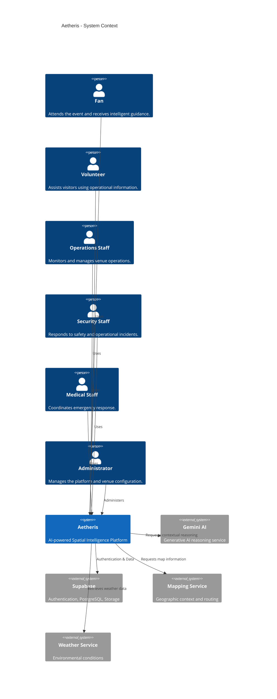
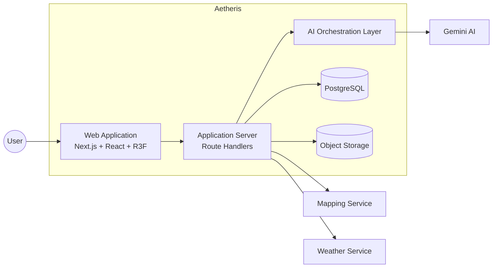
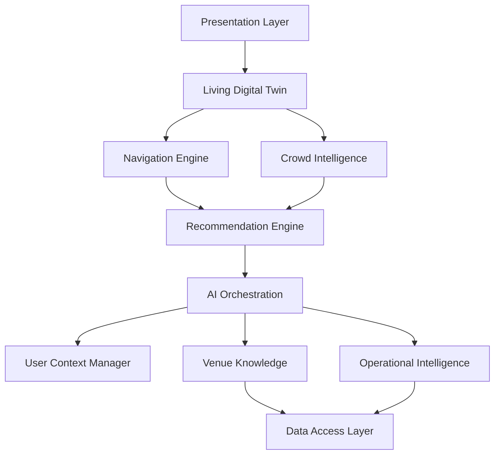
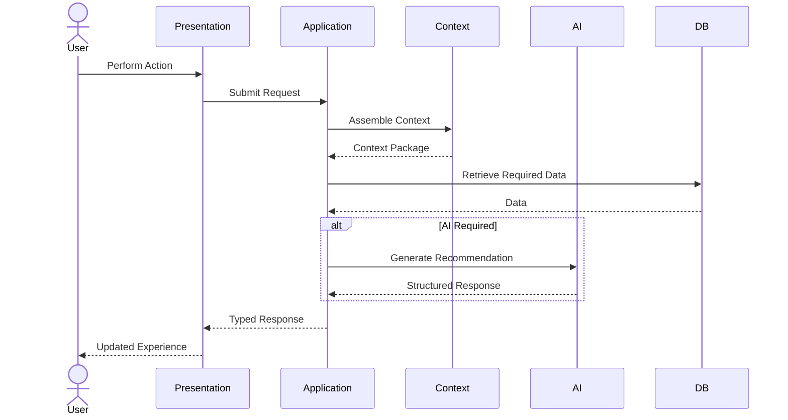

# Aetheris System Architecture

> **Version:** 1.0
>
> **Project:** Aetheris
>
> **Status:** Living Document
>
> **Purpose:** Define the complete software architecture of Aetheris and describe how the system is organized, how its major components interact, and how it satisfies the architectural goals established by the Product Requirements Document and Architecture Decision Records.

---

# Introduction

Software architecture describes the structure of a system, the responsibilities of its major components, and the relationships between them.

This document serves as the implementation blueprint for Aetheris.

Unlike the Product Requirements Document, which defines *what* the product is, or the Architecture Decision Records, which explain *why* architectural decisions were made, this document focuses on *how the system is organized*.

It provides a shared understanding of the application's architecture for developers, designers, reviewers, and future contributors.

---

# Scope

This document describes:

- the overall system architecture
- software boundaries
- component responsibilities
- communication patterns
- data flow
- AI integration
- deployment topology
- security boundaries
- scalability strategy
- operational quality attributes

Implementation details belong within the codebase and supporting technical documentation rather than this document.

---

# Relationship to Other Documents

This document should be read together with the following project documentation.

| Document | Responsibility |
|-----------|----------------|
| PRD v1.0 | Defines the product vision, requirements, and functional scope. |
| ADRs | Record why major architectural decisions were made. |
| Design Language | Defines the visual and interaction philosophy. |
| Design System | Defines reusable UI patterns and components. |
| Design Tokens | Defines the visual constants used throughout the interface. |
| Brand Guidelines | Defines the identity and communication principles of Aetheris. |
| Engineering Standards | Defines implementation conventions and code quality expectations. |
| AI Architecture | Defines the internal architecture of the intelligence layer. |

Together, these documents form the complete engineering knowledge base of Aetheris.

---

# Architectural Objectives

The architecture of Aetheris is designed to satisfy the following objectives.

- Maintain clear separation of concerns.
- Support modular feature development.
- Enable long-term maintainability.
- Preserve strong type safety across the application.
- Support scalable AI integration.
- Deliver a responsive and immersive user experience.
- Protect sensitive operations through secure architectural boundaries.
- Enable future evolution without large-scale redesign.

These objectives guide every architectural decision throughout the project.

---

# Architecture Philosophy

The architecture of Aetheris follows several fundamental principles.

## Modular

Each subsystem owns a clearly defined responsibility.

---

## Composable

Complex capabilities emerge from the composition of smaller independent modules.

---

## Context-Aware

Every layer operates using contextual information rather than isolated requests.

---

## Secure by Design

Security is integrated into architectural boundaries rather than added afterwards.

---

## Performance-Oriented

Responsiveness is considered a core functional requirement.

---

## Evolvable

The architecture should support future capabilities without requiring fundamental restructuring.

---

# Architectural Viewpoints

Aetheris is documented using multiple complementary architectural viewpoints.

Each viewpoint answers different questions for different audiences.

| View | Purpose |
|------|---------|
| System Context | How Aetheris interacts with external actors and systems. |
| Container | How the application is divided into major runtime units. |
| Component | How important containers are internally organized. |
| Runtime | How requests move through the system. |
| Deployment | How the system is deployed and operated. |

These viewpoints collectively describe the complete architecture without overwhelming a single diagram or audience.

---

# Guiding Principle

Architecture should reduce complexity rather than introduce it.

Every component, service, module, and interface should exist because it contributes directly to the goals of the system.

If a component cannot justify its responsibility, it should not exist.

---

**End of Introduction**

---

# Architecture Principles

The architecture of Aetheris is governed by a set of immutable engineering principles.

These principles define how every subsystem, service, feature, API, and module should be designed.

If a future implementation conflicts with these principles, the implementation—not the principles—should be reconsidered.

---

# Principle 1 — Single Responsibility

Every architectural element should own one clearly defined responsibility.

Examples include:

- rendering
- authentication
- AI orchestration
- navigation
- storage
- recommendation generation

Responsibilities should never overlap unnecessarily.

---

# Principle 2 — Separation of Concerns

Business logic, presentation, data persistence, artificial intelligence, and infrastructure should remain independent.

Each layer should solve only the problems appropriate to that layer.

This reduces coupling and simplifies future evolution.

---

# Principle 3 — Modularity

The system should be composed of independent modules that can evolve without requiring large-scale changes elsewhere.

Every feature should:

- own its business logic
- expose well-defined interfaces
- minimize dependencies

Feature boundaries should remain explicit.

---

# Principle 4 — Composition over Complexity

Large capabilities should emerge through the composition of smaller modules.

Avoid monolithic components that perform multiple unrelated responsibilities.

Complexity should be distributed rather than concentrated.

---

# Principle 5 — Context-Driven Intelligence

Artificial Intelligence should never operate in isolation.

Every AI interaction begins with contextual understanding.

Context may include:

- stakeholder role
- spatial location
- operational conditions
- environmental state
- previous interactions
- current objective

Context is considered a first-class architectural concern.

---

# Principle 6 — Spatial First

Physical space is the organizing principle of the application.

Every operational insight should relate back to a location within the venue whenever possible.

The Living Digital Twin remains the primary representation of operational state.

---

# Principle 7 — Secure by Design

Security is built into architectural boundaries rather than added afterwards.

Security principles include:

- least privilege
- authenticated access
- explicit authorization
- protected secrets
- validated inputs
- secure communication

Every subsystem inherits these requirements.

---

# Principle 8 — Performance as a Functional Requirement

Responsiveness is part of the product.

Performance targets influence architectural decisions from the beginning.

Examples include:

- efficient rendering
- optimized network requests
- lazy loading
- streaming responses
- asset optimization

Performance should never become an afterthought.

---

# Principle 9 — Type Safety

Every boundary between components should be explicitly typed.

Examples include:

- APIs
- AI outputs
- database entities
- shared models
- events

Compile-time validation should eliminate as many runtime errors as possible.

---

# Principle 10 — Observability

Every important operation should be observable.

The architecture should support:

- structured logging
- error reporting
- request tracing
- performance measurement
- AI usage monitoring

Systems that cannot be observed cannot be improved.

---

# Principle 11 — Progressive Enhancement

The platform should remain functional across a wide range of devices.

Advanced capabilities should enhance the experience without becoming mandatory.

Examples include:

- advanced shaders
- post-processing
- premium animations
- high-fidelity rendering

Core functionality should remain accessible even when these features are unavailable.

---

# Principle 12 — Scalability

The architecture should allow new features, services, and integrations without requiring fundamental redesign.

Scalability includes:

- feature scalability
- engineering scalability
- operational scalability
- AI scalability

Growth should occur through extension rather than modification.

---

# Architectural Layers

Aetheris is organized into independent architectural layers.

```text
Presentation

↓

Experience

↓

Application

↓

AI Orchestration

↓

Domain

↓

Data Access

↓

Infrastructure
```

Each layer communicates only with adjacent layers.

Dependencies always flow downward.

Lower layers must never depend upon higher layers.

---

# Dependency Rules

The architecture follows strict dependency boundaries.

Allowed:

```text
UI

↓

Application

↓

Domain

↓

Infrastructure
```

Not allowed:

```text
Infrastructure

↓

UI
```

Business rules should remain independent of implementation technologies.

---

# Feature Independence

Every major feature should be independently maintainable.

Examples include:

- Navigation
- Accessibility
- Crowd Intelligence
- Operations
- Transportation
- Recommendations

Each feature owns:

- components
- services
- hooks
- types
- tests
- business logic

Shared functionality belongs only in shared modules.

---

# Architectural Constraints

The following constraints apply across the entire project.

- No duplicated business logic.
- No direct AI provider integration outside the AI layer.
- No database access from presentation components.
- No hardcoded secrets.
- No circular dependencies.
- No tightly coupled feature modules.
- No implementation that bypasses established architectural boundaries.

Violations should be treated as architectural defects.

---

# Architecture Quality Goals

Every implementation should improve one or more of the following qualities.

- Maintainability
- Reliability
- Security
- Performance
- Testability
- Scalability
- Accessibility
- Observability
- Developer Experience

Architectural decisions should be evaluated against these qualities before implementation.

---

# Principle Summary

The architecture of Aetheris is designed to support long-term evolution rather than short-term implementation speed.

Every subsystem should remain:

- modular
- understandable
- replaceable
- observable
- secure
- performant

These principles provide the foundation for every architectural view described in the remainder of this document.

---

---

# System Context (C4 Level 1)

## Purpose

The System Context view provides the highest-level representation of Aetheris.

It answers one question:

> **How does Aetheris fit into the world?**

At this level, implementation technologies, databases, and internal software components are intentionally hidden.

The focus is on:

- People
- External software systems
- System boundaries
- High-level interactions

This view should be understandable by both technical and non-technical stakeholders.

---

# System Scope

Aetheris is an AI-powered Spatial Intelligence Platform that assists multiple stakeholders during large-scale sporting events.

Its responsibilities include:

- operational awareness
- intelligent navigation
- accessibility guidance
- multilingual assistance
- contextual recommendations
- venue visualization
- decision support

Everything inside the Aetheris boundary is owned by the project.

External services remain outside that boundary.

---

# Primary Actors

## Fan

Primary attendee using Aetheris for:

- navigation
- accessibility
- recommendations
- transportation
- venue exploration

---

## Volunteer

Supports spectators by using operational information, navigation assistance, and live venue intelligence.

---

## Operations Staff

Monitors venue operations and uses Aetheris to understand overall operational state.

Responsibilities include:

- crowd awareness
- operational alerts
- venue monitoring
- decision support

---

## Security Staff

Uses operational intelligence to monitor crowd conditions, respond to incidents, and maintain venue safety.

---

## Medical Staff

Uses Aetheris to:

- locate incidents
- determine optimal response routes
- understand crowd conditions
- coordinate emergency response

---

## Event Administrator

Responsible for:

- operational configuration
- venue management
- user administration
- system monitoring

---

# External Systems

The following systems exist outside the Aetheris system boundary.

## Gemini AI Platform

Provides large language model capabilities including:

- contextual reasoning
- multilingual understanding
- recommendation generation
- operational intelligence

---

## Supabase Platform

Provides:

- authentication
- PostgreSQL database
- storage
- realtime services

---

## Mapping Services

Provides:

- geographic context
- routing metadata
- location services

Used to complement venue navigation where external geographic context is required.

---

## Weather Service

Provides environmental information including:

- weather conditions
- forecasts
- severe weather events

Environmental data influences operational recommendations.

---

## Web Browser

Acts as the primary client runtime.

Responsible for rendering the Aetheris experience and interacting with users.

---

# System Boundary

Everything inside the Aetheris boundary is developed and maintained by the project.

Everything outside the boundary represents an external dependency.

The internal implementation of external systems is outside the scope of this architecture.

---

# High-Level Responsibilities

Aetheris is responsible for:

- presenting the Living Digital Twin
- assembling operational context
- orchestrating AI reasoning
- generating recommendations
- visualizing venue intelligence
- coordinating user interactions
- managing authenticated sessions

External systems provide supporting capabilities but do not determine application behavior.

---

# C4 Level 1 Diagram



---

# Interaction Summary

| Actor / System | Interaction |
|----------------|------------|
| Fan | Receives navigation, recommendations, accessibility guidance, and operational awareness. |
| Volunteer | Uses operational intelligence to assist spectators. |
| Operations Staff | Monitors venue conditions and operational insights. |
| Security Staff | Responds to incidents using live venue intelligence. |
| Medical Staff | Uses contextual routing and emergency information. |
| Administrator | Configures and manages the platform. |
| Gemini AI | Performs contextual reasoning and recommendation generation. |
| Supabase | Provides authentication, storage, and relational data services. |
| Mapping Service | Supplies geographic and routing context. |
| Weather Service | Supplies environmental information used in operational decision-making. |

---

# Context Boundaries

This diagram intentionally excludes:

- frontend modules
- backend services
- API endpoints
- database schema
- internal AI pipeline
- rendering engine
- deployment infrastructure

These are documented in subsequent C4 levels.

---

# Design Notes

The System Context view establishes Aetheris as a single software system surrounded by its users and supporting software systems.

It intentionally avoids implementation details.

Its purpose is to communicate the role of Aetheris within the wider operational ecosystem before introducing the system's internal architecture.

---

---

# Container Architecture (C4 Level 2)

## Purpose

The Container Architecture view zooms into the Aetheris system boundary established in the System Context diagram.

At this level, the architecture describes the major runtime containers that together form the complete application.

A container represents an independently executable application, service, or data store.

It is **not** a Docker container.

Its purpose is to define major execution boundaries within the software system.

---

# Architectural Overview

Aetheris consists of several cooperating runtime containers.

Each container owns a clearly defined responsibility.

No container should perform responsibilities that belong to another container.

The architecture favors clear boundaries over convenience.

---

# Container Inventory

## Container 1 — Web Application

Technology

- Next.js
- React
- TypeScript
- Tailwind CSS
- React Three Fiber

Responsibilities

- User Interface
- Living Digital Twin
- Authentication Flow
- Navigation Experience
- User Interactions
- State Management
- Rendering

Primary Users

- Fans
- Volunteers
- Operations
- Security
- Medical
- Administrators

---

## Container 2 — Application Server

Technology

- Next.js Route Handlers
- TypeScript

Responsibilities

- Business Logic
- Authentication
- Authorization
- API Layer
- AI Orchestration
- Request Validation
- Context Assembly

This container represents the application's trusted execution environment.

Sensitive operations remain here.

---

## Container 3 — AI Orchestration Layer

Technology

- TypeScript

Responsibilities

- Context Builder
- Prompt Builder
- Provider Selection
- Response Validation
- Explainability
- Confidence Estimation
- Structured Output

The orchestration layer abstracts AI providers from the rest of the application.

Application features never communicate directly with an external model.

---

## Container 4 — PostgreSQL Database

Technology

- PostgreSQL
- Supabase

Responsibilities

- User Data
- Venue Data
- Operational Data
- Navigation Metadata
- Preferences
- Historical Records

The database represents the system of record.

---

## Container 5 — Object Storage

Technology

- Supabase Storage

Responsibilities

- Images
- Icons
- Venue Assets
- 3D Models
- Static Files

Large binary assets remain outside the relational database.

---

# External Dependencies

The following systems remain outside the Aetheris boundary.

## Gemini AI

Provides:

- reasoning
- multilingual understanding
- recommendation generation

Gemini never communicates directly with frontend components.

---

## Mapping Services

Provides:

- geographic metadata
- location context
- external routing information

---

## Weather Services

Provides:

- current weather
- forecasts
- environmental alerts

---

# Container Responsibilities

| Container | Responsibility |
|-----------|----------------|
| Web Application | Presentation and interaction |
| Application Server | Business logic and secure orchestration |
| AI Orchestration | Intelligence pipeline |
| PostgreSQL | Persistent structured data |
| Object Storage | Static and binary assets |

Every responsibility belongs to exactly one container.

---

# Container Communication

The architecture follows strict communication paths.

```text
Browser

↓

Web Application

↓

Application Server

↓

AI Orchestration

↓

Gemini
```

and

```text
Browser

↓

Web Application

↓

Application Server

↓

PostgreSQL
```

No frontend component communicates directly with external providers.

---

# C4 Level 2 Diagram



---

# Data Ownership

Each container owns its data.

Ownership boundaries must remain explicit.

Examples:

Web Application

Owns:

- transient UI state

Application Server

Owns:

- request lifecycle
- business rules

AI Layer

Owns:

- prompts
- context
- validation

Database

Owns:

- persistent structured information

Storage

Owns:

- binary assets

---

# Container Interaction Rules

The following rules apply across the architecture.

## Rule 1

Frontend components never access the database directly.

---

## Rule 2

Frontend components never communicate with AI providers.

---

## Rule 3

Business logic remains inside the Application Server.

---

## Rule 4

Prompt construction belongs exclusively to the AI Orchestration Layer.

---

## Rule 5

Persistent data is retrieved only through authenticated APIs.

---

## Rule 6

Every container communicates through explicit interfaces.

No container should depend upon another container's internal implementation.

---

# Quality Attributes

The container architecture is designed to maximize:

- maintainability
- scalability
- security
- replaceability
- observability
- performance

Changes inside one container should have minimal impact on others.

---

# Notes

This view intentionally omits:

- React component hierarchy
- Feature modules
- Database schema
- Prompt lifecycle
- Deployment infrastructure

Those concerns are documented in later architectural views.

---

---

# Component Architecture (C4 Level 3)

## Purpose

The Component Architecture view decomposes the primary Aetheris application into its major functional building blocks.

Unlike the Container Architecture, which describes independently deployable runtime units, the Component Architecture describes cohesive modules that collaborate inside a single application container.

Each component encapsulates a specific business capability behind well-defined interfaces.

Implementation details such as classes, hooks, and individual functions remain outside the scope of this document.

---

# Architectural Strategy

Aetheris follows a **feature-first modular architecture**.

Business capabilities are organized around product features rather than technical layers.

Each feature owns:

- presentation
- application logic
- domain rules
- services
- types
- tests

This organization improves maintainability, scalability, and developer onboarding.

---

# High-Level Component Structure

```text
Presentation Layer

↓

Experience Layer

↓

Feature Layer

↓

Application Layer

↓

AI Layer

↓

Domain Layer

↓

Infrastructure Layer
```

Each layer has clearly defined responsibilities.

Dependencies always flow downward.

---

# Core Components

## Presentation Layer

Responsibilities

- page composition
- layouts
- responsive rendering
- accessibility
- user interaction

Contains

- App Router pages
- layouts
- shared UI
- global providers

This layer never contains business logic.

---

## Living Digital Twin Engine

Responsibilities

- stadium rendering
- scene composition
- camera system
- spatial interaction
- animation
- overlays

Subcomponents

- Scene Manager
- Camera Controller
- Lighting System
- Environment Manager
- Layer Renderer

The Living Digital Twin remains the primary interaction surface of Aetheris.

---

## Navigation Engine

Responsibilities

- route generation
- route visualization
- waypoint management
- accessibility routing
- rerouting

Consumes

- venue data
- crowd intelligence
- accessibility information

Produces

- navigation instructions
- route overlays

---

## Crowd Intelligence Engine

Responsibilities

- crowd visualization
- congestion analysis
- density classification
- hotspot identification

Consumes

- operational data
- venue context

Produces

- crowd overlays
- congestion indicators

---

## Recommendation Engine

Responsibilities

- recommendation generation
- recommendation prioritization
- recommendation explanation

Consumes

- AI outputs
- contextual information

Produces

- actionable recommendations

---

## AI Orchestration

Responsibilities

- context assembly
- prompt construction
- provider abstraction
- response validation
- confidence estimation
- explainability

This component represents the application's intelligence pipeline.

---

## Authentication Module

Responsibilities

- session management
- authentication
- authorization
- user identity

No business logic beyond identity management belongs here.

---

## User Context Manager

Responsibilities

- active stakeholder
- permissions
- language
- preferences
- accessibility profile

Provides contextual information to the rest of the system.

---

## Venue Knowledge Service

Responsibilities

- venue metadata
- gates
- seating
- facilities
- zones
- accessibility infrastructure

Acts as the authoritative source of venue structure.

---

## Operational Intelligence Service

Responsibilities

- operational status
- incident aggregation
- transportation state
- weather integration
- venue conditions

Transforms raw operational information into structured context.

---

## Data Access Layer

Responsibilities

- persistence
- querying
- caching
- repository abstraction

This layer isolates business logic from storage implementation.

---

## Shared Foundation

Responsibilities

- utilities
- shared types
- validation
- constants
- configuration

No business-specific logic belongs here.

---

# Component Relationships

The architecture encourages directional dependencies.

```text
Presentation

↓

Living Digital Twin

↓

Feature Components

↓

Application Services

↓

AI

↓

Domain

↓

Data Access
```

Components should communicate only through explicit interfaces.

---

# Component Interaction Diagram



---

# Component Responsibilities Matrix

| Component | Primary Responsibility |
|------------|------------------------|
| Presentation | User interaction |
| Living Digital Twin | Spatial visualization |
| Navigation Engine | Intelligent routing |
| Crowd Intelligence | Operational awareness |
| Recommendation Engine | Action generation |
| AI Orchestration | Contextual reasoning |
| User Context Manager | User state |
| Venue Knowledge | Static venue information |
| Operational Intelligence | Dynamic operational state |
| Data Access | Persistence |

Every responsibility has a single owner.

---

# Communication Rules

## Rule 1

Presentation components never access persistence directly.

---

## Rule 2

Business rules remain independent of rendering logic.

---

## Rule 3

Spatial components never own business state.

---

## Rule 4

Recommendations originate from the Recommendation Engine only.

---

## Rule 5

AI interactions occur exclusively through the AI Orchestration component.

---

## Rule 6

Shared components remain free of feature-specific business logic.

---

# Component Quality Attributes

Every component should be:

- cohesive
- independently testable
- replaceable
- observable
- type-safe
- documented

Large components should be decomposed before becoming difficult to reason about.

---

# Dependency Principles

Allowed

```text
Feature

↓

Application

↓

Domain

↓

Infrastructure
```

Not Allowed

```text
Infrastructure

↓

Presentation
```

Business rules must remain independent of implementation technologies.

---

# Design Philosophy

Components represent business capabilities rather than implementation details.

The architecture favors meaningful boundaries over framework conventions.

Developers should navigate the codebase by understanding the product rather than the technology stack.

---

# Notes

This component view intentionally omits:

- classes
- functions
- React hooks
- database tables
- API endpoints

Those implementation details belong within the codebase rather than the architectural documentation.

---

---

# Request Lifecycle

## Purpose

The Request Lifecycle describes how a user interaction travels through Aetheris.

Unlike previous architectural views, this section focuses on runtime behaviour rather than static structure.

Every request follows a predictable processing pipeline regardless of which stakeholder initiated it.

This consistency improves:

- maintainability
- observability
- debugging
- security
- scalability

---

# Request Philosophy

Every request should satisfy four objectives.

1. Understand the user.

2. Understand the context.

3. Produce the correct result.

4. Present that result clearly.

The application should never process requests without sufficient contextual understanding.

---

# High-Level Lifecycle

Every request passes through the following stages.

```text
User Interaction

↓

Presentation Layer

↓

Application Layer

↓

Context Assembly

↓

Business Logic

↓

AI (if required)

↓

Data Access

↓

Response Construction

↓

Presentation Update
```

Each stage owns one clearly defined responsibility.

---

# Stage 1 — User Interaction

A request begins when a stakeholder performs an action.

Examples include:

- selecting a destination
- requesting navigation
- opening a venue zone
- viewing accessibility information
- asking for operational guidance
- responding to an alert

At this stage no business logic has executed.

Only user intent has been captured.

---

# Stage 2 — Presentation Layer

The Presentation Layer validates:

- interaction type
- local state
- required parameters

Responsibilities include:

- input handling
- accessibility support
- optimistic feedback
- interaction state

The Presentation Layer never performs business decisions.

---

# Stage 3 — Application Layer

The Application Layer becomes responsible for processing the request.

Responsibilities include:

- request routing
- authentication
- authorization
- feature selection
- workflow orchestration

Business rules begin here.

---

# Stage 4 — Context Assembly

Context is assembled before any reasoning occurs.

Possible context includes:

## User

- role
- permissions
- language
- accessibility profile

---

## Spatial

- current location
- destination
- selected venue zone

---

## Operational

- crowd density
- incidents
- transportation
- venue state

---

## Environmental

- weather
- time
- event schedule

---

## Historical

- recent interactions
- active session
- current navigation

Context assembly should remain deterministic and repeatable.

---

# Stage 5 — Business Logic

Business services determine whether AI reasoning is required.

Examples:

Simple request

↓

Retrieve venue information.

Complex request

↓

Request AI recommendation.

The application should avoid unnecessary AI requests whenever deterministic logic is sufficient.

---

# Stage 6 — AI Reasoning (Optional)

Only requests requiring intelligent reasoning enter the AI pipeline.

Examples include:

- best entrance recommendation
- accessibility optimisation
- crowd-aware routing
- multilingual explanation
- operational recommendations

Deterministic requests bypass this stage entirely.

---

# Stage 7 — Data Access

Persistent information is retrieved only after required permissions have been verified.

Responsibilities include:

- queries
- updates
- transactions
- caching

The Presentation Layer never communicates directly with persistence.

---

# Stage 8 — Response Construction

The Application Layer constructs a response using:

- business results
- AI output
- database information
- presentation metadata

Responses should remain:

- predictable
- typed
- validated

Free-form responses should be minimized.

---

# Stage 9 — Presentation Update

The interface updates using:

- smooth transitions
- progressive disclosure
- contextual highlighting

Visual feedback should communicate:

- completion
- errors
- loading
- recommendations

The interface should never abruptly change state.

---

# Request Sequence Diagram



---

# Request Types

The architecture recognises three request categories.

## Deterministic

Examples:

- authentication
- venue lookup
- profile updates

AI not required.

---

## Contextual

Examples:

- navigation
- accessibility routing
- transportation

Context required.

AI optional.

---

## Intelligent

Examples:

- recommendations
- decision support
- multilingual guidance

AI required.

---

# Error Handling

Errors should be classified into:

## Validation Errors

Incorrect user input.

---

## Authorization Errors

Permission denied.

---

## Operational Errors

Temporary service failure.

---

## AI Errors

Model unavailable.

Timeout.

Invalid response.

---

## Infrastructure Errors

Storage.

Database.

Network.

External services.

Each category should follow an independent recovery strategy.

---

# Observability

Every request should generate structured telemetry including:

- request identifier
- timestamp
- authenticated user
- feature
- execution duration
- AI usage (if applicable)
- result
- error classification

Logs should support debugging without exposing sensitive information.

---

# Performance Targets

The request lifecycle is designed around the following goals.

| Metric | Target |
|---------|--------|
| Initial acknowledgement | < 100 ms |
| Standard request | < 500 ms |
| AI-assisted request | < 3 s (streamed where practical) |
| UI feedback | Immediate |
| Animation continuity | 60 FPS target |

---

# Architectural Principles Reinforced

The Request Lifecycle reinforces several previously established principles.

- Context before reasoning.
- Business logic before AI.
- AI only when required.
- Typed responses.
- Explicit ownership.
- Secure boundaries.
- Progressive presentation.

These principles ensure that every request behaves consistently regardless of feature or stakeholder.

---

---

# Deployment Architecture

## Purpose

The Deployment Architecture describes how Aetheris is deployed into its production environment.

Unlike the previous architectural views, which focus on software structure, this section focuses on where the application runs and how its major runtime components are connected.

The deployment strategy prioritizes simplicity, security, maintainability, and rapid iteration while remaining suitable for a production-quality web application.

---

# Deployment Philosophy

The deployment architecture follows four guiding principles.

- Managed infrastructure over self-managed infrastructure.
- Secure server-side execution for sensitive operations.
- Minimal operational complexity.
- Fast and reliable deployments.

The infrastructure should allow the development team to focus on building product features rather than maintaining servers.

---

# Production Environment

The production deployment consists of the following runtime environments.

## Client

- Modern Web Browser

Responsible for:

- Rendering the user interface
- Executing client-side interactions
- Displaying the Living Digital Twin
- Managing local application state

---

## Frontend & Application Server

Platform

- Vercel

Responsibilities

- Next.js application hosting
- Server-side rendering
- Route Handlers
- Secure API execution
- AI orchestration entry point

---

## Backend Platform

Platform

- Supabase

Responsibilities

- Authentication
- PostgreSQL Database
- Object Storage
- Row Level Security

---

## Artificial Intelligence

Platform

- Gemini

Responsibilities

- Contextual reasoning
- Recommendation generation
- Multilingual assistance
- Operational intelligence

---

# Deployment Topology

```text
                  User

                   │

             Web Browser

                   │

             HTTPS Request

                   │

        ┌─────────────────────┐
        │       Vercel        │
        │  Next.js Web App    │
        │ + Route Handlers    │
        └─────────────────────┘
           │             │
           │             │
           ▼             ▼

     Supabase        Gemini API

(PostgreSQL/Auth)   (AI Reasoning)

           │
           ▼

     Object Storage
```

---

# Deployment Responsibilities

| Platform | Responsibility |
|----------|----------------|
| Web Browser | User interaction and rendering |
| Vercel | Application hosting, routing, secure server execution |
| Supabase | Authentication, database, storage |
| Gemini | AI reasoning and recommendation generation |

Each platform owns a clearly defined responsibility.

---

# Communication

All communication occurs over secure HTTPS connections.

The browser communicates only with the Aetheris application.

External services are accessed exclusively through trusted server-side components.

Sensitive credentials are never exposed to the client.

---

# Environment Strategy

The project should support the following environments.

| Environment | Purpose |
|------------|---------|
| Development | Local development and testing |
| Preview | Pull request validation and stakeholder review |
| Production | Public deployment |

Configuration differences should be managed through environment variables rather than code changes.

---

# Deployment Principles

The deployment architecture follows these principles.

- Immutable deployments.
- Environment-specific configuration.
- Server-side secret management.
- Managed infrastructure.
- Automated deployment pipeline.
- Reproducible builds.

---

# Future Evolution

The deployment architecture intentionally remains simple.

Future enhancements may include:

- CDN optimization
- Edge execution
- Monitoring and analytics
- Performance observability
- Regional deployments

These improvements should not require changes to the application's core architecture.

---

# Architecture Summary

The Aetheris architecture is intentionally modular, secure, and maintainable.

The Product Requirements Document defines **what** Aetheris is.

The Architecture Decision Records explain **why** architectural decisions were made.

This document describes **how** those decisions are realized through the system architecture.

Together, these documents provide a complete architectural foundation for the implementation of Aetheris.

---

# Digital Twin — Production Stadium Architecture

> Added in Phase 6 Priority 1.1

## Overview

The Digital Twin's visual layer uses a production GLB model (KOREA Jeju World Cup Stadium 4K, 500K triangles) as its authoritative spatial reference. All coordinates, entity positions, and routing waypoints are derived relative to its geometry.

## Mandatory Architecture

```
User
  ↓
Experience Layer
  ↓
Camera System
  ↓
Scene Adapter (StadiumSpatialAdapter)
  ↓
Visual Stadium (StadiumGLB)
  ↓
Invisible Interaction Layer (StadiumInteractionLayer)
  ↓
Entity Registry (GLB-anchored positions)
  ↓
Routing Engine (Nodes on walkable areas)
  ↓
AI Services
  ↓
Backend (Future)
```

## Three-Layer Stadium Composition

```
StadiumFoundation (composition root)
  ├── StadiumSpatialAdapter (transforms GLB → routing space)
  │     └── StadiumGLB (pure visual rendering)
  └── StadiumInteractionLayer (invisible colliders in routing space)
```

### Layer 1: Scene Adapter

`StadiumSpatialAdapter` is the **single source of truth** for transforms:
- Scale: 0.40 (maps 548-unit GLB to ~219-unit routing space)
- Position: [0, 1.0, 0] (ground alignment)
- No other system should know how the GLB is transformed

### Layer 2: GLB Rendering

`StadiumGLB` is a pure visual component:
- Loaded via `useGLTF()` with module-level `preload()`
- Preserves all PBR materials from the model
- No business logic, no interaction handling
- Can be replaced without affecting any other system

### Layer 3: Invisible Interaction

`StadiumInteractionLayer` provides user interaction:
- Transparent collision meshes positioned to conform to the stadium geometry (stands wrap the seating bowl, gates at actual perimeter)
- Completely independent of GLB mesh names
- Handles hover, select, click through `useExperienceDirector`
- Renders outside the SpatialAdapter (uses routing coordinates directly)

## Configuration

All stadium configuration lives in `stadium-config.ts`:
- Asset metadata
- Transform values
- Bounding boxes
- Camera profiles (Hero, Landing, Overview, Navigation, Operations, Accessibility, Journey, Emergency)
- Lighting presets (Match Day, Golden Hour, Morning, Night)

No magic numbers exist outside this file.

## GLB-First Spatial Mapping

In Phase 6 Priority 1.1, the coordinate system was fully adapted to the GLB geometry:
- **Entity Anchoring**: All gates, zones, and POIs in `entity-definitions.ts` are relocated to align with the actual geometry boundaries.
- **Routing Graph**: Graph nodes in `GraphBuilder.ts` are moved directly onto walkable concourses (following an elliptical path at 85×78 radius) and entrance paths.
- **Pointer Event Separation**: Canvas events are isolated using R3F's `eventSource` and `eventPrefix` configuration, preventing clicks on HTML overlays from triggering 3D canvas actions.

## Related Documentation

- [STADIUM_ASSET.md](./STADIUM_ASSET.md) — Detailed GLB analysis and asset documentation
- [ATTRIBUTIONS.md](./ATTRIBUTIONS.md) — License and attribution information

---

**End of System Architecture**